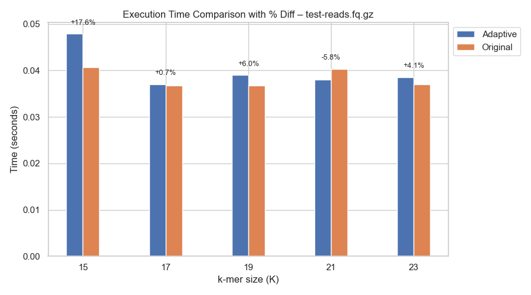
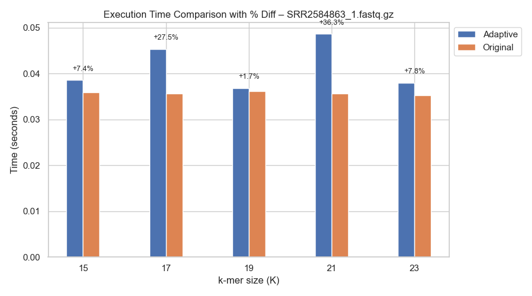
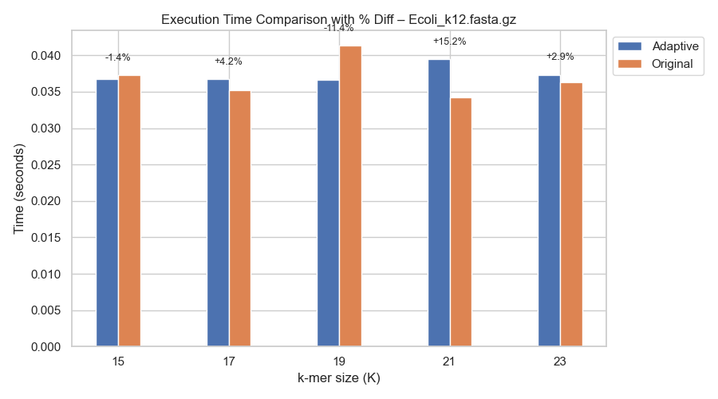
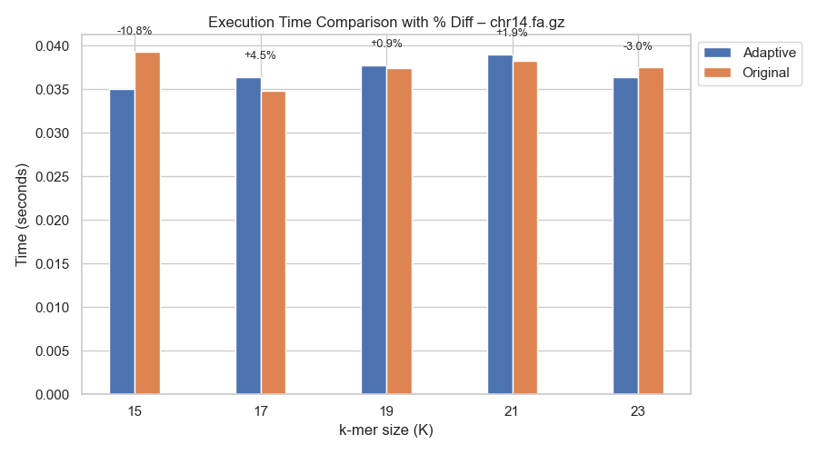

# ntCard with Adaptive Entropy-Based Spaced Seed Hashing

This is a modified version of [ntCard](https://github.com/bcgsc/ntCard) that integrates an adaptive entropy-based spaced seed hashing mechanism. The enhancement dynamically switches between sparse and dense seeds based on local Shannon entropy, improving k-mer estimation performance on diverse genomic regions.

---

## Key Features

- **Entropy-Aware Hashing**: Uses real-time Shannon entropy to adapt between dense and sparse spaced seed hashing.
- **Dynamic Seed Generation**: Seed patterns are generated dynamically based on the user-defined `k`, eliminating hardcoded seed-length mismatches.
- **Fully Integrated**: Both `ntcard` and `nthll` executables now use the `adaptive_hash()` function internally for all sequence processing.
- **OpenMP Parallelism**: Processes files concurrently using OpenMP for fast multi-threaded execution.
- **Backward-Compatible CLI**: Still accepts familiar parameters like `-k`, `-h`, `-e`, and files — works out-of-the-box.

---

## Usage

```
./ntcard -k 15 -h 1 -e 1.5 test-reads.fq.gz
```

| Option | Description |
|--------|-------------|
| `-k`   | Length of the k-mer |
| `-h`   | Number of hashes per seed |
| `-e`   | Entropy threshold to switch between sparse/dense seeds |
| `<file>` | Input FASTA/FASTQ/SAM file (plain or gzipped) |

---

## Example

We tested the adaptive version with:

```
./ntcard -k 15 -h 1 -e 1.5 test-reads.fq.gz
```

Sample output:

```
[AdaptiveHash] Using adaptive spaced seed hashing with entropy threshold = 1.5
[AdaptiveHash] Dense seeds used: 0, Sparse seeds used: 421
[AdaptiveHash] Total adaptive hashes generated: 421
[AdaptiveHash] Adaptive hashing completed in 6.5e-06 seconds.
```

---

## Benchmark Comparison

We compared execution time (in seconds) between the Adaptive and Original ntCard across multiple datasets and k-mer sizes.

### test-reads.fq.gz


### SRR2584863_1.fastq.gz


### Ecoli_k12.fasta.gz


### chr14.fa.gz


---

## Notes

- Seeds are no longer hardcoded. The dense seed is generated as `"111...1"` of length `k`, and the sparse seed as a `"1010..."` pattern (every 3rd position).
- If the sequence is shorter than `k`, it is skipped automatically.
- The warning from `SeedNtHash` about non-symmetric seeds is expected for certain sparse patterns. This does not affect forward-strand-only use.

---

## Limitations

While the adaptive spaced seed hashing provides theoretical benefits in handling low-complexity or repetitive genomic regions, it's **not always faster** than the original ntCard due to the following reasons:

- **Entropy Overhead**: Real-time Shannon entropy calculation adds computational cost, especially for small k-mer sizes and shorter datasets.
- **High-Entropy Bias**: If a sequence is mostly high-entropy, the system will rarely switch to sparse seeds, reducing the effectiveness of adaptivity.
- **Short Execution Time Granularity**: For many datasets, ntCard already runs in milliseconds. The benefits of adaptivity may not be visible without long or repetitive inputs.
- **Optimization Potential**: The current implementation can be further optimized (e.g., entropy caching, SIMD acceleration, hybrid hasher structure) to close the performance gap.

---

## Project Structure

- `adaptive_hash.cpp` – Implements the core adaptive hashing logic.
- `ntcard.cpp` – Now invokes `adaptive_hash()` on all input sequences.
- `nthll.cpp` – Also rerouted to use adaptive hashing.
- `entropy.hpp/cpp` – Rolling entropy calculation logic.
- `Makefile` – Builds the project with OpenMP and static linking.

---

## Build & Ignore Files

This repo uses Autotools and OpenMP. You can run:
```
./autogen.sh
./configure
make
```

---

## Credits

Original ntCard authors: Hamid Mohamadi et al.  
Adaptive hashing extension by [Siddhartha Mahesha Pundit](https://github.com/SiddharthaStoic)

---

## License

MIT License — same as original ntCard.